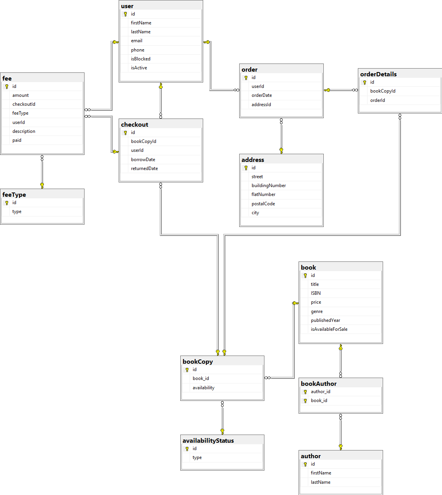

# Baza danych i aplikacja do zarządzania komercyjną księgarnią-bibilioteką.

## Baza danych

W folderze DB znajdują się następujące pliki:
   + **CreateDB/library.sql** - skrypt do stworzenia i zasiania bazy danych.
   + **Fee/ChargeLateFeeProcedure.sql** - skrypt który tworzy procedurę, odpowiedzialną za naliczanie kary za spóźnienie w oddaniu książki i zablokowanie użytkownika.
   + **Reports/SalesByGenrePerPeriod.sql** - dzięki tej procedurze, można wygenerować raport pokazujący ile w danym okresie sprzedało się książek z poszczególnych gatunków.
   + **Reports/ShowBookInventoryReportProcedure.sql** - ta procedura generuje raport, pokazujący ile kopii poszczególnych książek jest na stanie, wypożyczona lub sprzedana.
   + **LateReturnReportProcedure.sql** - procedura zwracająca listę użytkowników zalegających ze zwrotem książki. Można ją wykorzystać w hipotetycznym oknie aplikacji, do szybkiego podglądu kogo trzeba pogonić ze zwrotem.

## Aplikacja

Aplikacja jest wykonana w technologii .NET MVC i pozwala przeprowadzić operacje na encji użytkowników.

## Schemat bazy

